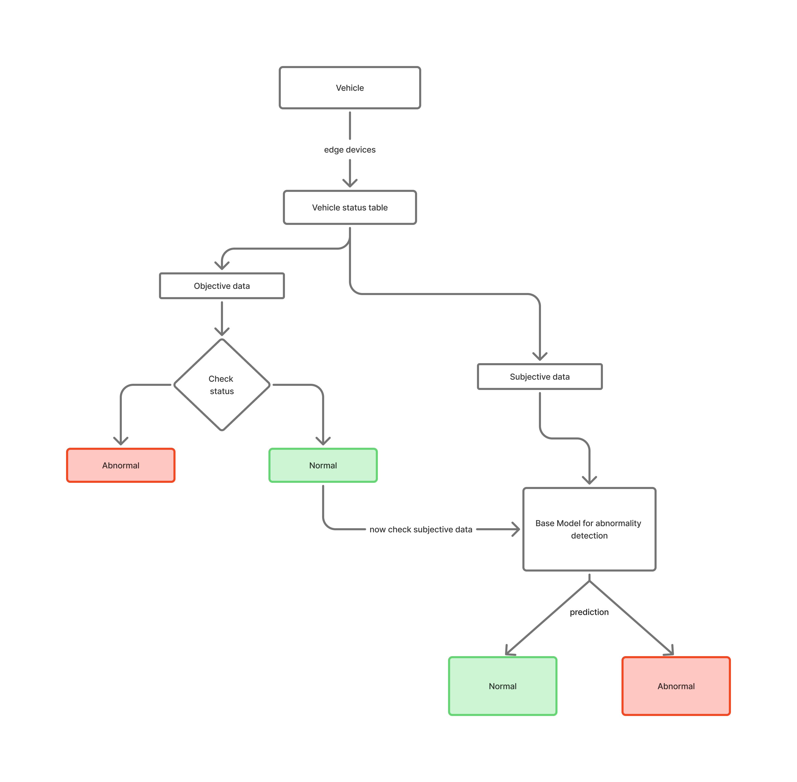

# Abnormality Detection in Vehicles and Broadcasting

Version: Draft

## Objective

We want to detect potential abnormality in vehicles driving on roads and broadcast them to nearby vehicles as well as local safety enforcement departments such as police or transport department.

## Key Research Papers and Articles on Vehicle Abnormality Detection and Reporting

  
Click to expand

  ### 1. **A Survey of Anomaly Detection in In-Vehicle Networks**
  - **Summary:** This comprehensive survey reviews 85 papers on anomaly detection in in-vehicle networks, with a focus on the CAN bus. It covers traditional and deep learning methods (e.g., RNNs, autoencoders, graph-based algorithms), discusses the strengths and weaknesses of each approach, and highlights the need for better datasets that include both attack-induced and naturally occurring anomalies. The survey is a valuable resource for understanding the landscape of vehicle network anomaly detection and outlines future research directions[1].
  - **Link:** [arXiv:2409.07505](https://arxiv.org/html/2409.07505v1)
  
  ---
  
  ### 2. **MEDAVET: Traffic Vehicle Anomaly Detection Mechanism Based on Spatial and Temporal Structures**
  - **Summary:** This paper presents MEDAVET, a computer vision system that leverages spatial and temporal structures to detect anomalies in highway traffic. The system uses object tracking, bipartite graphs, and QuadTree-based approaches to identify occluded and stationary vehicles, outperforming other state-of-the-art methods in precision and computational efficiency[2].
  - **Link:** [Journal of Internet Services and Applications](https://journals-sol.sbc.org.br/index.php/jisa/article/view/3809)
  
  ---
  
  ### 3. **Automatic Anomaly Detection Using Vehicle Condition Monitoring Data Without Additional Sensors**
  - **Summary:** Proposes a neural network-based method to detect anomalies in vehicle equipment using only existing condition monitoring data, without extra sensors. The system calculates an anomaly score based on deviations from normal operating patterns, enabling timely maintenance and reducing breakdown risks[3].
  - **Link:** [RTRI Research](https://www.rtri.or.jp/eng/rd/seika/2021/02-14.html)
  
  ---
  
  ### 4. **Sensor Data Based Anomaly Detection in Autonomous Vehicles**
  - **Summary:** Introduces an anomaly detection model using a modified convolutional neural network (M-CNN) and the SPMD dataset. The paper discusses frameworks for identifying abnormal behaviors in connected and automated vehicles (CAVs), including edge computing and sensor data fusion strategies[4].
  - **Link:** [Tech Science Press](https://www.techscience.com/iasc/v32n2/45580/html)
  
  ---
  
  ### 5. **A Dangerous Driving Behavior Detection Method Based on Improved YOLOv8s**
  - **Summary:** Presents an enhanced YOLOv8s-CDS algorithm for detecting dangerous driving behaviors (e.g., smoking, phone use, drowsiness) using computer vision. The model integrates advanced modules for better feature extraction and detection accuracy, achieving high precision in real-world scenarios and supporting traffic safety interventions[5].
  - **Link:** [Engineering Letters (PDF)](http://www.engineeringletters.com/issues_v33/issue_3/EL_33_3_19.pdf)
  
  ---
  
  ### 6. **Anomaly Detection as Vision-Based Obstacle Detection for Vehicle Automation in Industrial Environment**
  - **Summary:** Explores the use of deep hybrid anomaly detection models for vision-based obstacle detection in automated guided vehicles (AGVs) in industrial settings. The approach combines pre-trained feature extractors (e.g., MobileNet, ResNet) with shallow classifiers and demonstrates robust performance with minimal training data[6].
  - **Link:** [Frontiers in Manufacturing Technology](https://www.frontiersin.org/journals/manufacturing-technology/articles/10.3389/fmtec.2022.918343/full)
  
  ---
  
  ### 7. **Prediction of Dangerous Driving Behavior Based on Vehicle Motion State and Passenger’s Subjective Feelings**
  - **Summary:** Proposes a new model (CM-ENN) that predicts dangerous driving behaviors by combining vehicle sensor data with passenger feedback. The model utilizes neural networks and achieves high accuracy in predicting unsafe driving events, highlighting the value of integrating subjective and objective data[7].
  - **Link:** [Frontiers in Neurorobotics](https://www.frontiersin.org/journals/neurorobotics/articles/10.3389/fnbot.2021.641007/full)
  
  ---
  
  ### 8. **OBD SecureAlert: An Anomaly Detection System for Vehicles**
  - **Summary:** Describes an anomaly detection system using CAN message data and Hidden Markov Models (HMMs) to identify abnormal vehicle states. The system can be implemented as a plug-and-play device via the OBD-II port and is effective for both new and legacy vehicles[8].
  - **Link:** [UMBC Ebiquity (PDF)](https://ebiquity.umbc.edu/_file_directory_/papers/792.pdf)
  
  ---
  
  ### 9. **Deep Learning Approach for Aggressive Driving Behaviour Detection**
  - **Summary:** Utilizes smartphone GPS data and deep learning (RNNs, GRU, LSTM) to classify and detect aggressive driving behaviors in real time. The method is independent of vehicle or driver characteristics and achieves high accuracy, offering a practical solution for monitoring driver behavior[9].
  - **Link:** [arXiv (PDF)](https://arxiv.org/pdf/2111.04794.pdf)
  
  ---
  
  ### 10. **Vehicle Operating State Anomaly Detection and Results Virtual Reality Interpretation**
  - **Summary:** Develops an ARIMA-based framework for detecting abnormal vehicle operating states using multi-channel time series data. The results are visualized in a virtual reality environment for intuitive interpretation and decision-making[10].
  - **Link:** [ScienceDirect](https://www.sciencedirect.com/science/article/abs/pii/S0957417421003699)
  
  ---
  
  ### 11. **Detection of Driving Capability Degradation for Human-Machine Cooperative Driving**
  - **Summary:** Introduces a new index for driver correction ability and combines it with risk assessment to detect driving capability degradation. The method enables timely switching between manual and automatic driving modes, improving safety and reducing unnecessary interventions[11].
  - **Link:** [PMC](https://pmc.ncbi.nlm.nih.gov/articles/PMC7181156/)
  
  ---
  
  ### 12. **Analysis of Abnormal Vehicle Behavior Based on Trajectory Fitting**
  - **Summary:** Proposes a three-step process (target detection, trajectory fitting, abnormality analysis) for analyzing abnormal vehicle behavior using trajectory data. The approach is effective for identifying outlier behaviors in traffic scenarios[12].
  - **Link:** [Journal of Computer and Communications](https://www.scirp.org/journal/papercitationdetails?paperid=61270&JournalID=2431)
  
  ---
  
  ## Additional Notes
  
  - Many of these articles discuss both the detection of anomalies (including bad driving and equipment faults) and the reporting/broadcasting of such events, either to the driver, fleet managers, or external systems.
  - The field is rapidly evolving, with a trend toward deep learning, sensor fusion, and integration with vehicle-to-everything (V2X) communication for real-time anomaly reporting and intervention.
  
  ---
  
  **For full access to the articles, please use the provided links. Some articles may require institutional access or purchase for the complete text.**
  
  Citations:
  [1] https://arxiv.org/html/2409.07505v1
  [2] https://journals-sol.sbc.org.br/index.php/jisa/article/view/3809
  [3] https://www.rtri.or.jp/eng/rd/seika/2021/02-14.html
  [4] https://www.techscience.com/iasc/v32n2/45580/html
  [5] http://www.engineeringletters.com/issues_v33/issue_3/EL_33_3_19.pdf
  [6] https://www.frontiersin.org/journals/manufacturing-technology/articles/10.3389/fmtec.2022.918343/full
  [7] https://www.frontiersin.org/journals/neurorobotics/articles/10.3389/fnbot.2021.641007/full
  [8] https://ebiquity.umbc.edu/_file_directory_/papers/792.pdf
  [9] https://arxiv.org/pdf/2111.04794.pdf
  [10] https://www.sciencedirect.com/science/article/abs/pii/S0957417421003699
  [11] https://pmc.ncbi.nlm.nih.gov/articles/PMC7181156/
  [12] https://www.scirp.org/journal/papercitationdetails?paperid=61270&JournalID=2431
  [13] https://www.sciencedirect.com/science/article/pii/S2667393222000023
  [14] https://www.mdpi.com/2076-3417/13/9/5525
  [15] https://www.sciencedirect.com/science/article/abs/pii/S2214209624000779
  [16] https://www.mdpi.com/2079-9292/13/7/1251
  [17] https://www.mdpi.com/1424-8220/23/11/5013
  [18] https://www.sciencedirect.com/science/article/abs/pii/S2542660524001860
  [19] https://onlinelibrary.wiley.com/doi/10.1155/2021/9961428
  [20] https://arxiv.org/abs/2405.02731
  [21] https://arxiv.org/html/2405.02731v1
  [22] https://www.sciencedirect.com/science/article/pii/S1877050918319665
  [23] https://www.sciencedirect.com/science/article/abs/pii/S0360835224007897
  [24] https://arxiv.org/abs/2409.07505
  [25] https://www.mdpi.com/2076-3417/12/19/10011
  [26] https://dl.acm.org/doi/10.1145/3674700.3674702
  [27] https://www.sciencedirect.com/science/article/abs/pii/S2352152X25004402
  [28] https://www.sciencedirect.com/science/article/abs/pii/S0968090X22003965
  [29] https://www.mdpi.com/2073-8994/14/10/1956
  [30] https://www.tandfonline.com/doi/full/10.1080/08839514.2023.2216060
  [31] https://www.mdpi.com/1424-8220/24/5/1386
  [32] https://www.mdpi.com/2032-6653/16/2/62
  [33] https://www.mdpi.com/1999-5903/16/8/288
  

## Assumptions

### Sample space

- We are considering vehicles driving on main roads, expressways and highways and not in neighbourhood roads.
- We consider the idea to be implemented on all vehicles in our sample space.
- We consider the vehicle to be of a standard size (example: private 4 wheelers)

## Abnormality

We propose a set of conditions for detecting abnormality in the vehicle:

### 1. Objective factors:

These factors are to be evaluated directly based on vehicle data.

- Mechanical and electrical issues within the vehicle
- Using phone or engagement in other activity while driving

### 2. Subjective factors:

These factors are to be evaluated by the model based on vehicle data.

- Weaving (S-shaped movement within lane)
- Swerving (Abrupt direction changes)
- Sideslipping (Lateral deviation while moving straight)
- Turning with wide radius (High-speed turn drifting outside lane)
- Inattentive driving (Distracted or drowsy driving)
- Aggressive/reckless driving	(Speeding, tailgating, unsafe lane changes)
- Erratic acceleration (Rapid speed changes after steering)
- DUI (Driving under influence of alcohol or drugs)
- Improper overtaking	(Unsafe passing maneuvers)

## Simple Procedure for Vehicle Abnormality Detection

1. **Collect Data from Vehicle**
   - Use sensors and edge devices (like Arduino or Raspberry Pi) to gather vehicle data.

2. **Create Vehicle Status Table**
   - Store all collected data in a table for easy access and analysis.

3. **Check Objective Data**
   - Analyze direct signals (like engine status, speed, or phone usage).
   - If any abnormality is found here, label as **Abnormal** and send an alert.

4. **If Objective Data is Normal**
   - Continue to analyze subjective data (like driving behavior).

5. **Analyze Subjective Data**
   - Use a basic model (like a machine learning algorithm) to check for unusual driving patterns (weaving, swerving, etc.).

6. **Make Prediction**
   - If the model detects abnormal behavior, label as **Abnormal** and send an alert.
   - If everything is normal, continue monitoring.

## Tools and Experiment

TBD

